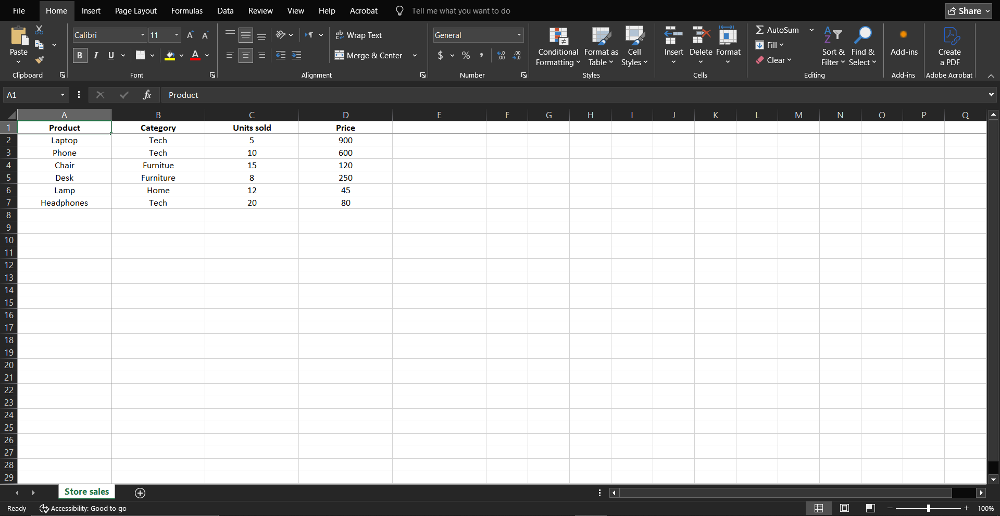
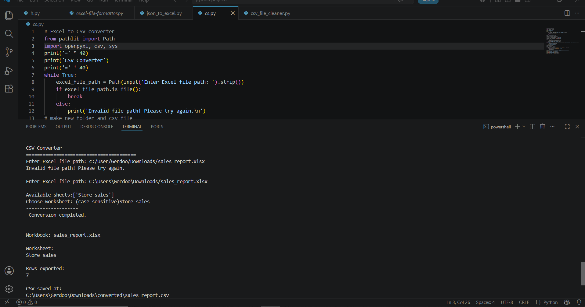

# 📄 Excel to CSV Converter

A Python automation tool that converts Excel worksheets into clean CSV files while allowing users to select the desired worksheet and export data into an organized output folder.

---

# 🖥️ Demo

### Excel Workbook ➜ Worksheet Selection ➜ CSV Output

  
  

  

---

# 🎯 Problem

Excel workbooks are commonly used for storing and sharing structured data, but many systems and applications require CSV format instead.

Manually copying worksheet data into CSV files is repetitive and can introduce errors during the conversion process.

---

# ✅ Solution

This tool automates Excel-to-CSV conversion by:

- Loading Excel workbooks
- Allowing users to choose a worksheet
- Exporting worksheet data into CSV format
- Saving the converted file separately without modifying the original workbook

---
